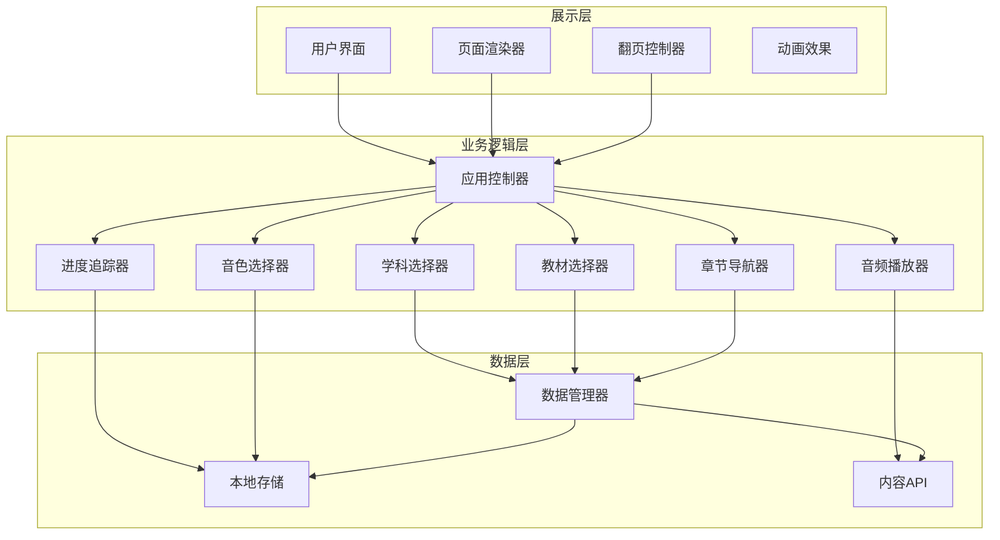
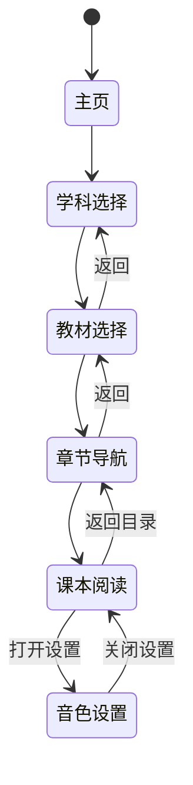

# 设计文档

## 概述

AI点读功能是一款基于HTML/CSS/JavaScript的Web应用，为小学生提供互动式电子课本学习体验。系统采用模块化架构设计，将学科选择、教材管理、页面渲染、音频播放等功能解耦为独立组件，通过事件驱动机制实现组件间通信。

核心技术选型：
- 前端框架：原生HTML5 + CSS3 + JavaScript（ES6+）
- 音频播放：Web Audio API / HTML5 Audio
- 动画效果：CSS3 Animations + JavaScript动画库
- 数据存储：LocalStorage（用户偏好和进度）
- 响应式设计：CSS Flexbox/Grid + Media Queries

## 架构

系统采用分层架构设计，分为展示层、业务逻辑层和数据层：



### 页面流程



## 组件和接口

### 1. AppController（应用控制器）

主控制器，负责协调各模块间的交互和页面导航。

```javascript
class AppController {
    constructor() {}
    
    // 初始化应用
    init(): void
    
    // 导航到指定页面
    navigateTo(page: PageType, params?: object): void
    
    // 获取当前页面状态
    getCurrentState(): AppState
    
    // 注册事件监听
    on(event: string, callback: Function): void
    
    // 触发事件
    emit(event: string, data?: any): void
}
```

### 2. SubjectSelector（学科选择器）

管理学科列表的展示和选择逻辑。

```javascript
class SubjectSelector {
    constructor(container: HTMLElement) {}
    
    // 加载学科列表
    loadSubjects(): Promise<Subject[]>
    
    // 渲染学科选择界面
    render(subjects: Subject[]): void
    
    // 选择学科
    selectSubject(subjectId: string): void
    
    // 获取当前选中的学科
    getSelectedSubject(): Subject | null
    
    // 高亮显示选中项
    highlightSelected(subjectId: string): void
}
```

### 3. TextbookSelector（教材选择器）

管理教材版本的展示和选择。

```javascript
class TextbookSelector {
    constructor(container: HTMLElement) {}
    
    // 根据学科加载教材列表
    loadTextbooks(subjectId: string): Promise<Textbook[]>
    
    // 渲染教材选择界面
    render(textbooks: Textbook[]): void
    
    // 选择教材
    selectTextbook(textbookId: string): void
    
    // 获取当前选中的教材
    getSelectedTextbook(): Textbook | null
    
    // 显示加载动画
    showLoading(): void
    
    // 隐藏加载动画
    hideLoading(): void
}
```

### 4. ChapterNavigator（章节导航器）

管理章节和课程的树形导航。

```javascript
class ChapterNavigator {
    constructor(container: HTMLElement) {}
    
    // 加载章节目录
    loadChapters(textbookId: string): Promise<Chapter[]>
    
    // 渲染章节树
    render(chapters: Chapter[]): void
    
    // 展开/折叠章节
    toggleChapter(chapterId: string): void
    
    // 选择课程
    selectLesson(lessonId: string): void
    
    // 显示课程预览
    showLessonPreview(lessonId: string): void
    
    // 更新学习进度显示
    updateProgress(progressData: ProgressData): void
}
```

### 5. PageRenderer（页面渲染器）

负责课本页面内容的渲染和交互。

```javascript
class PageRenderer {
    constructor(container: HTMLElement) {}
    
    // 加载页面内容
    loadPage(lessonId: string, pageNumber: number): Promise<PageContent>
    
    // 渲染页面
    render(content: PageContent): void
    
    // 标记可点读内容
    markClickableContent(elements: ClickableElement[]): void
    
    // 高亮当前朗读内容
    highlightContent(elementId: string): void
    
    // 取消高亮
    clearHighlight(): void
    
    // 处理缩放
    handleZoom(scale: number): void
    
    // 显示骨架屏
    showSkeleton(): void
}
```

### 6. AudioPlayer（音频播放器）

管理音频的加载和播放。

```javascript
class AudioPlayer {
    constructor() {}
    
    // 播放音频
    play(audioUrl: string): Promise<void>
    
    // 停止播放
    stop(): void
    
    // 暂停播放
    pause(): void
    
    // 继续播放
    resume(): void
    
    // 设置音色
    setVoice(voiceId: string): void
    
    // 获取播放状态
    getStatus(): PlaybackStatus
    
    // 监听播放完成
    onComplete(callback: Function): void
    
    // 监听播放错误
    onError(callback: Function): void
}
```

### 7. VoiceSelector（音色选择器）

管理音色的选择和预览。

```javascript
class VoiceSelector {
    constructor(container: HTMLElement) {}
    
    // 加载可用音色列表
    loadVoices(): Promise<Voice[]>
    
    // 渲染音色选择界面
    render(voices: Voice[]): void
    
    // 试听音色
    previewVoice(voiceId: string): Promise<void>
    
    // 选择音色
    selectVoice(voiceId: string): void
    
    // 获取当前选中的音色
    getSelectedVoice(): Voice
    
    // 保存用户偏好
    savePreference(voiceId: string): void
}
```

### 8. BookFlipper（翻页控制器）

管理书本翻页效果和导航。

```javascript
class BookFlipper {
    constructor(container: HTMLElement) {}
    
    // 初始化翻页功能
    init(totalPages: number): void
    
    // 翻到下一页
    nextPage(): boolean
    
    // 翻到上一页
    prevPage(): boolean
    
    // 跳转到指定页
    goToPage(pageNumber: number): void
    
    // 获取当前页码
    getCurrentPage(): number
    
    // 获取总页数
    getTotalPages(): number
    
    // 播放翻页动画
    playFlipAnimation(direction: 'left' | 'right'): Promise<void>
    
    // 显示边界提示
    showBoundaryMessage(type: 'first' | 'last'): void
}
```

### 9. ProgressTracker（进度追踪器）

管理学习进度的记录和展示。

```javascript
class ProgressTracker {
    constructor() {}
    
    // 记录页面访问
    recordPageVisit(lessonId: string, pageNumber: number): void
    
    // 记录课程完成
    recordLessonComplete(lessonId: string): void
    
    // 获取章节进度
    getChapterProgress(chapterId: string): number
    
    // 获取总体进度
    getOverallProgress(textbookId: string): number
    
    // 获取已学习的课程列表
    getCompletedLessons(): string[]
    
    // 显示祝贺动画
    showCongratulations(): void
}
```

### 10. DataManager（数据管理器）

统一管理数据的获取和缓存。

```javascript
class DataManager {
    constructor() {}
    
    // 获取学科列表
    getSubjects(): Promise<Subject[]>
    
    // 获取教材列表
    getTextbooks(subjectId: string): Promise<Textbook[]>
    
    // 获取章节列表
    getChapters(textbookId: string): Promise<Chapter[]>
    
    // 获取页面内容
    getPageContent(lessonId: string, pageNumber: number): Promise<PageContent>
    
    // 获取音频URL
    getAudioUrl(contentId: string, voiceId: string): string
    
    // 缓存数据
    cacheData(key: string, data: any): void
    
    // 获取缓存数据
    getCachedData(key: string): any | null
}
```

## 数据模型

### 核心数据类型

```typescript
// 学科
interface Subject {
    id: string;
    name: string;           // 学科名称：英语、语文、数学等
    icon: string;           // 学科图标URL
    color: string;          // 主题色
    order: number;          // 排序顺序
}

// 教材
interface Textbook {
    id: string;
    subjectId: string;
    name: string;           // 教材名称
    publisher: string;      // 出版社
    grade: number;          // 年级：1-6
    semester: string;       // 学期：上/下
    coverImage: string;     // 封面图片URL
    totalChapters: number;  // 总章节数
}

// 章节
interface Chapter {
    id: string;
    textbookId: string;
    name: string;           // 章节名称
    order: number;          // 章节顺序
    lessons: Lesson[];      // 课程列表
}

// 课程
interface Lesson {
    id: string;
    chapterId: string;
    name: string;           // 课程名称
    order: number;          // 课程顺序
    totalPages: number;     // 总页数
    previewText: string;    // 预览文本
}

// 页面内容
interface PageContent {
    lessonId: string;
    pageNumber: number;
    backgroundImage?: string;       // 背景图片
    clickableElements: ClickableElement[];  // 可点读元素列表
}

// 可点读元素
interface ClickableElement {
    id: string;
    type: 'text' | 'dialogue' | 'formula' | 'word';  // 内容类型
    content: string;        // 显示内容
    audioId: string;        // 关联音频ID
    position: {             // 元素位置
        x: number;
        y: number;
        width: number;
        height: number;
    };
    style?: {               // 可选样式
        fontSize?: string;
        color?: string;
        fontWeight?: string;
    };
}

// 音色
interface Voice {
    id: string;
    name: string;           // 音色名称
    type: 'male' | 'female' | 'child';  // 音色类型
    previewAudioUrl: string;    // 试听音频URL
    description: string;    // 音色描述
}

// 学习进度
interface ProgressData {
    lessonId: string;
    visitedPages: number[];     // 已访问页码
    isCompleted: boolean;       // 是否完成
    lastVisitTime: number;      // 最后访问时间戳
}

// 应用状态
interface AppState {
    currentPage: PageType;
    selectedSubject: Subject | null;
    selectedTextbook: Textbook | null;
    selectedLesson: Lesson | null;
    currentPageNumber: number;
    selectedVoice: Voice;
    isPlaying: boolean;
}

// 页面类型枚举
type PageType = 'home' | 'subject' | 'textbook' | 'chapter' | 'reading' | 'settings';

// 播放状态
interface PlaybackStatus {
    isPlaying: boolean;
    currentAudioId: string | null;
    progress: number;       // 0-100
}
```

### 本地存储数据结构

```typescript
// 用户偏好设置
interface UserPreferences {
    selectedVoiceId: string;
    lastSubjectId?: string;
    lastTextbookId?: string;
    fontSize: 'small' | 'medium' | 'large';
    animationsEnabled: boolean;
}

// 学习记录
interface LearningRecord {
    textbookId: string;
    progress: {
        [lessonId: string]: ProgressData;
    };
    totalCompletedLessons: number;
    lastStudyTime: number;
}
```


## 正确性属性

*正确性属性是指在系统所有有效执行中都应保持为真的特征或行为——本质上是关于系统应该做什么的形式化陈述。属性作为人类可读规范和机器可验证正确性保证之间的桥梁。*

### Property 1: 学科选择状态同步

*对于任意*学科和用户点击操作，选择学科后系统状态应正确更新：选中的学科应被高亮显示，且系统应自动导航到教材选择界面。

**Validates: Requirements 1.2, 1.3**

### Property 2: 教材列表正确显示

*对于任意*学科ID和该学科下的教材数据集，进入教材选择界面后显示的教材列表应包含且仅包含属于该学科的所有教材。

**Validates: Requirements 2.1**

### Property 3: 教材选择状态记录

*对于任意*教材选择操作，选择后系统应正确记录选中的教材，且后续获取当前选中教材时应返回相同的教材对象。

**Validates: Requirements 2.2**

### Property 4: 加载状态显示一致性

*对于任意*数据加载操作（教材、页面等），在加载过程中系统应显示加载指示器（动画或骨架屏），加载完成后应隐藏加载指示器。

**Validates: Requirements 2.3, 4.4**

### Property 5: 章节树正确渲染

*对于任意*教材的章节数据，章节导航器渲染后应包含所有章节，且每个章节应包含其所有课程。

**Validates: Requirements 3.1**

### Property 6: 章节展开折叠状态

*对于任意*章节，点击展开后该章节的课程列表应可见，再次点击后课程列表应隐藏。

**Validates: Requirements 3.2**

### Property 7: 课程选择加载页面

*对于任意*课程选择操作，系统应加载该课程的第一页内容，且页面渲染器应显示该课程的页面内容。

**Validates: Requirements 3.3**

### Property 8: 进度标识显示正确性

*对于任意*章节和对应的学习进度数据，章节导航器应正确显示该章节的进度标识，已完成的课程应有完成标识，未完成的课程应有未完成标识。

**Validates: Requirements 3.4, 9.2**

### Property 9: 可点读元素标识

*对于任意*页面内容中的可点读元素，页面渲染器应为其添加视觉标识（如特殊样式或图标），使其与普通内容可区分。

**Validates: Requirements 4.2**

### Property 10: 点击播放音频

*对于任意*可点读元素，点击后音频播放器应开始播放该元素对应的音频，且播放状态应变为"正在播放"。

**Validates: Requirements 5.1**

### Property 11: 播放状态与高亮同步

*对于任意*音频播放操作，播放开始时对应元素应被高亮，播放结束时高亮应被清除。高亮状态应与播放状态保持同步。

**Validates: Requirements 5.2, 5.6**

### Property 12: 音频切换正确性

*对于任意*正在播放的音频和新的点击操作，点击新的可点读元素后，当前音频应停止，新音频应开始播放，高亮应从旧元素转移到新元素。

**Validates: Requirements 5.3**

### Property 13: 多类型内容播放支持

*对于任意*内容类型（text、dialogue、formula、word），音频播放器应能正确加载和播放对应的音频。

**Validates: Requirements 5.4**

### Property 14: 音色列表显示

*对于任意*可用音色数据集，打开音色设置后应显示所有可用音色，且每个音色应显示其名称和类型。

**Validates: Requirements 6.1**

### Property 15: 音色试听功能

*对于任意*音色，点击试听按钮后应播放该音色的预览音频。

**Validates: Requirements 6.2**

### Property 16: 音色偏好持久化往返

*对于任意*音色选择操作，选择音色后保存偏好，再次获取用户偏好时应返回相同的音色ID。这是一个往返属性：save(voiceId) → get() === voiceId。

**Validates: Requirements 6.3**

### Property 17: 翻页导航正确性

*对于任意*当前页码和总页数，向左滑动（下一页）应使页码加1（除非已是最后一页），向右滑动（上一页）应使页码减1（除非已是第一页）。

**Validates: Requirements 7.1, 7.2**

### Property 18: 页码显示正确性

*对于任意*页面状态，显示的当前页码应等于实际的当前页码，显示的总页数应等于实际的总页数。

**Validates: Requirements 7.6**

### Property 19: 进度记录往返

*对于任意*页面访问操作，访问页面后记录应被保存，查询该课程的进度时应包含该页面的访问记录。这是一个往返属性：recordVisit(lessonId, page) → getProgress(lessonId).visitedPages.includes(page)。

**Validates: Requirements 9.1**

### Property 20: 总体进度计算正确性

*对于任意*教材和其下所有课程的完成状态，总体进度百分比应等于已完成课程数除以总课程数。

**Validates: Requirements 9.3**

### Property 21: 课程完成祝贺触发

*对于任意*课程，当该课程所有页面都被访问后标记为完成时，系统应触发祝贺动画显示。

**Validates: Requirements 9.4**

## 错误处理

### 网络错误

| 错误场景 | 处理方式 | 用户提示 |
|---------|---------|---------|
| 学科数据加载失败 | 显示重试按钮，缓存上次成功数据 | "加载失败，请点击重试" |
| 教材数据加载失败 | 显示重试按钮 | "教材加载失败，请重试" |
| 页面内容加载失败 | 显示重试按钮，保持当前页面 | "页面加载失败，请重试" |
| 音频加载失败 | 显示重试选项 | "音频加载失败，点击重试" |

### 边界情况

| 边界场景 | 处理方式 |
|---------|---------|
| 教材无内容 | 显示"内容即将上线"提示 |
| 翻到第一页再向前翻 | 显示"已是第一页"提示，禁止翻页 |
| 翻到最后一页再向后翻 | 显示"已是最后一页"提示，禁止翻页 |
| 本地存储已满 | 清理旧数据，保留最近学习记录 |
| 音频播放被中断 | 清除高亮状态，重置播放器 |

### 输入验证

- 所有用户输入应进行XSS防护
- 页码参数应验证在有效范围内
- ID参数应验证格式正确性

## 测试策略

### 测试方法

本项目采用双重测试策略：

1. **单元测试**：验证具体示例、边界情况和错误条件
2. **属性测试**：验证跨所有输入的通用属性

两种测试方法互补，共同提供全面的测试覆盖。

### 属性测试配置

- **测试框架**：fast-check（JavaScript属性测试库）
- **最小迭代次数**：每个属性测试100次
- **标签格式**：`Feature: ai-reading-pen, Property {number}: {property_text}`

### 单元测试范围

单元测试应覆盖：
- 具体的功能示例
- 边界情况（第一页/最后一页、空数据等）
- 错误处理场景
- 组件集成点

### 属性测试范围

每个正确性属性应有对应的属性测试：

| 属性编号 | 测试描述 | 生成器 |
|---------|---------|--------|
| Property 1 | 学科选择状态同步 | 随机学科数据 |
| Property 2 | 教材列表正确显示 | 随机学科ID和教材列表 |
| Property 3 | 教材选择状态记录 | 随机教材对象 |
| Property 5 | 章节树正确渲染 | 随机章节树结构 |
| Property 6 | 章节展开折叠状态 | 随机章节ID |
| Property 8 | 进度标识显示正确性 | 随机进度数据 |
| Property 9 | 可点读元素标识 | 随机可点读元素 |
| Property 10 | 点击播放音频 | 随机可点读元素 |
| Property 11 | 播放状态与高亮同步 | 随机播放操作序列 |
| Property 12 | 音频切换正确性 | 随机元素对 |
| Property 16 | 音色偏好持久化往返 | 随机音色ID |
| Property 17 | 翻页导航正确性 | 随机页码和总页数 |
| Property 18 | 页码显示正确性 | 随机页面状态 |
| Property 19 | 进度记录往返 | 随机课程和页码 |
| Property 20 | 总体进度计算正确性 | 随机完成状态 |

### 测试文件结构

```
tests/
├── unit/
│   ├── SubjectSelector.test.js
│   ├── TextbookSelector.test.js
│   ├── ChapterNavigator.test.js
│   ├── PageRenderer.test.js
│   ├── AudioPlayer.test.js
│   ├── VoiceSelector.test.js
│   ├── BookFlipper.test.js
│   └── ProgressTracker.test.js
├── property/
│   ├── selection.property.test.js
│   ├── navigation.property.test.js
│   ├── audio.property.test.js
│   ├── progress.property.test.js
│   └── persistence.property.test.js
└── integration/
    ├── workflow.test.js
    └── e2e.test.js
```
