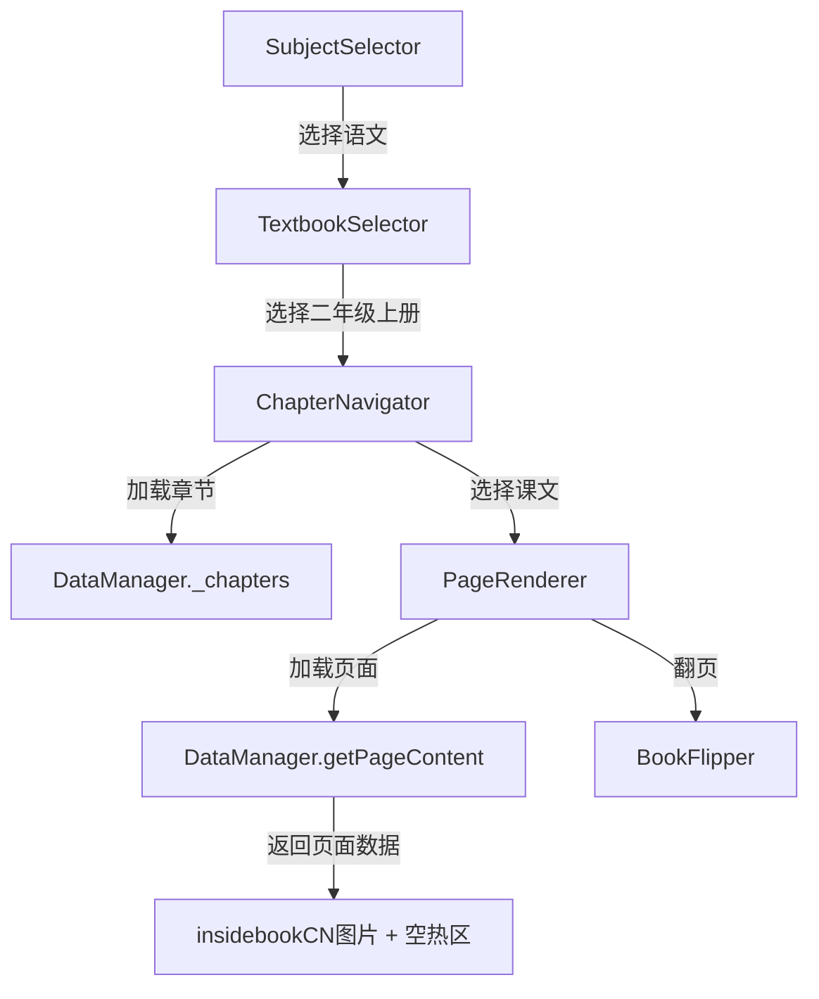

# 设计文档：语文教材支持

## 概述

本设计为现有AI点读笔应用增加完整的语文教材支持。核心工作集中在DataManager的模拟数据层——需要校验/修正课文目录数据、为所有课文添加页面内容数据条目、以及添加附录章节。现有的UI组件（PageRenderer、BookFlipper、ChapterNavigator等）已经是学科无关的设计，无需修改即可支持语文教材。

关键设计决策：由于当前只有第1课（小蝌蚪找妈妈）的4张图片（insidebookCN/_06.jpg至_09.jpg），其他课文的页面内容将以`backgroundImage: null`的形式预留，待后续图片资源到位后填充。

## 架构

现有架构已支持多学科，无需架构层面的变更。数据流如下：



变更范围仅限于 `DataManager._initMockData()` 方法中的数据：
1. `_chapters` 数组：校验/修正语文二年级上册的单元和课文数据，添加附录章节
2. `_pageContents` 对象：为所有语文课文添加页面内容条目

## 组件与接口

### DataManager（唯一需要修改的组件）

修改内容：

1. **章节数据校验与修正**（`_chapters` 数组中 `textbookId: 'chinese-rj-2-1-new'` 的条目）
   - 校验8个单元的课文名称和数量是否与实际教材一致
   - 修正任何不一致的课文名称或顺序
   - 添加第9个章节：附录（包含识字表、写字表、词语表）

2. **页面内容数据扩展**（`_pageContents` 对象）
   - 第1课已有4页数据（insidebookCN/_06.jpg至_09.jpg），保持不变
   - 为其余所有课文添加页面内容条目，`backgroundImage` 设为 `null`，`clickableElements` 设为空数组
   - 附录条目同样添加页面内容条目

### 现有组件（无需修改）

| 组件 | 原因 |
|------|------|
| PageRenderer | 已支持 `backgroundImage: null` 的情况（显示空白页面），已支持空 `clickableElements` |
| BookFlipper | 学科无关，仅处理页码和翻页动画 |
| ChapterNavigator | 学科无关，根据 `_chapters` 数据动态渲染 |
| SubjectSelector | 已包含语文学科数据（`id: 'chinese'`） |
| TextbookSelector | 已包含语文教材数据（`id: 'chinese-rj-2-1-new'`） |
| AudioPlayer | 学科无关，根据热区数据播放音频 |
| AppController | 学科无关，路由和状态管理不受影响 |

## 数据模型

### 章节数据结构（已有，无变更）

```javascript
{
    id: 'chinese-rj-2-1-new-unit1',        // 章节ID
    textbookId: 'chinese-rj-2-1-new',       // 教材ID
    name: '第一单元·阅读',                    // 章节名称
    order: 1,                                // 排序
    lessons: [                               // 课文列表
        {
            id: 'chinese-rj-2-1-new-lesson1',
            chapterId: 'chinese-rj-2-1-new-unit1',
            name: '1 小蝌蚪找妈妈',
            order: 1,
            totalPages: 4,
            previewText: '小蝌蚪找妈妈的故事'
        }
    ]
}
```

### 附录章节数据结构（新增）

```javascript
{
    id: 'chinese-rj-2-1-new-appendix',
    textbookId: 'chinese-rj-2-1-new',
    name: '附录',
    order: 9,
    lessons: [
        { id: 'chinese-rj-2-1-new-appendix-szb', chapterId: 'chinese-rj-2-1-new-appendix', name: '识字表', order: 1, totalPages: 2, previewText: '识字表' },
        { id: 'chinese-rj-2-1-new-appendix-xzb', chapterId: 'chinese-rj-2-1-new-appendix', name: '写字表', order: 2, totalPages: 2, previewText: '写字表' },
        { id: 'chinese-rj-2-1-new-appendix-cyb', chapterId: 'chinese-rj-2-1-new-appendix', name: '词语表', order: 3, totalPages: 2, previewText: '词语表' }
    ]
}
```

### 页面内容数据结构（已有，无变更）

```javascript
// 有图片的课文（如第1课）
'chinese-rj-2-1-new-lesson1': {
    1: {
        lessonId: 'chinese-rj-2-1-new-lesson1',
        pageNumber: 1,
        backgroundImage: 'insidebookCN/_06.jpg',
        clickableElements: []
    }
}

// 暂无图片的课文
'chinese-rj-2-1-new-lesson2': {
    1: {
        lessonId: 'chinese-rj-2-1-new-lesson2',
        pageNumber: 1,
        backgroundImage: null,
        clickableElements: []
    }
}
```


## 正确性属性

*正确性属性是一种在系统所有有效执行中都应成立的特征或行为——本质上是关于系统应该做什么的形式化陈述。属性是人类可读规范与机器可验证正确性保证之间的桥梁。*

### Property 1: 语文课文页面内容完整性

*For any* 语文二年级上册教材中的课文，调用 `getPageContent(lessonId, pageNumber)` 应返回一个包含 `lessonId`、`pageNumber`、`backgroundImage` 和 `clickableElements` 字段的有效 PageContent 对象，且 `clickableElements` 为空数组。

**Validates: Requirements 3.1, 3.3, 6.1**

## 错误处理

本次变更仅涉及数据层的模拟数据修改，错误处理策略沿用现有机制：

1. **图片加载失败**：PageRenderer 已有 `img.onerror` 处理，隐藏加载失败的图片并输出控制台错误
2. **页面内容不存在**：DataManager.getPageContent 已有 fallback 逻辑，返回 `backgroundImage: null` 的默认内容
3. **课文ID无效**：DataManager.getLesson 已有 null 返回处理

无需新增错误处理逻辑。

## 测试策略

### 单元测试

针对 DataManager 的数据完整性进行验证：

1. **目录数据测试**：验证8个单元 + 附录的课文数量和名称与教材一致
2. **页面内容测试**：验证第1课的4页引用正确的 insidebookCN 图片路径
3. **学科数据测试**：验证语文学科在 subjects 列表中存在

### 属性测试

使用 fast-check 库进行属性测试：

- **Property 1**：从所有语文课文中随机选取课文和页码，验证 getPageContent 返回的数据结构完整性
- 最少运行 100 次迭代
- 每个测试标注对应的设计属性编号
- 标注格式：**Feature: chinese-textbook-support, Property 1: 语文课文页面内容完整性**
